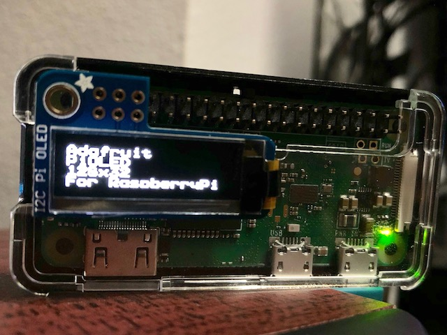
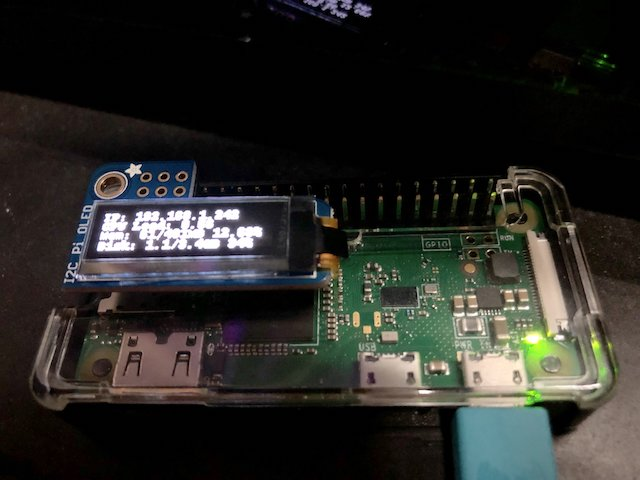

# OLED control for Adafruit PiOLED

A command line tool to control Adafruit [PiOLED](https://www.adafruit.com/product/3527).

## Installation

1. If you have not do it already, configure I2C on your Raspberry Pi (https://learn.adafruit.com/adafruits-raspberry-pi-lesson-4-gpio-setup/configuring-i2c)
2. Download the program at [Release](https://github.com/siuying/oled/releases)
3. Transfer it into your Raspberry Pi and copy it to your `$PATH`
4. Download a font suitable for small screen. I recommend [Press Start](https://www.dafont.com/press-start.font).

## Usage

```
sudo oled ./start.ttf "Adafruit" "PiOLED" "128x32" "For RaspberryPi"
```



Try `stats.sh` for a more useful example:

